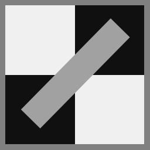
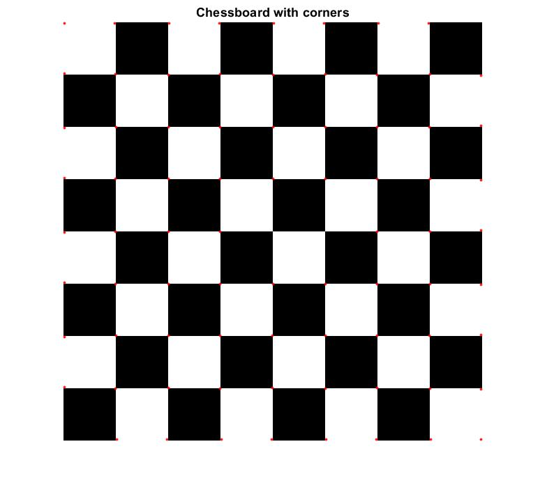
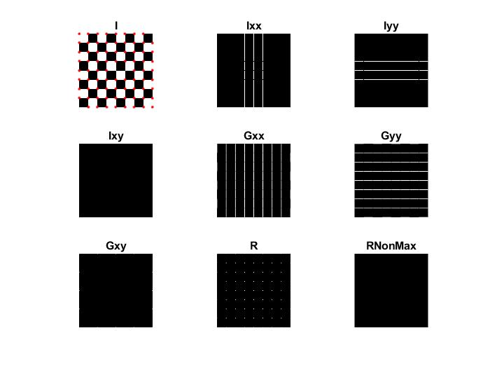

## Image denoising(que1.m)
Use "leena_noisy.jpg" for the experiment.

Generate gaussian filters and apply it on the image using various sigma values.
 
## Template matching(que2.m)
### Template "where-is-waldo.jpg"

### Target image "waldo.jpg"

- Find the location of the target image in template image using normalized cross correlation

## Sobel edge detection(que3.m)
1. Define sobel kernels
2. Apply kernels and find the edges
### Test image

If possible write your own code for convolution and correlation

## Hough Transform(que4.m)
1. Use sobel to find the threshold
2. Use canny edge detection on the input image
3. Define houghVotes() function
4. Define houghPeaks() function
5. Define drawHoughLines() function

- Apply hough transform on this image 

- Output should look something like this 

## Harris corner detector(que5.m)
1. First first order derivatives of same size of the image
2. Find second degree derivatives
3. Apply Gaussian smoothing
4. Find R matrix
5. Apply non-max suppresion
6. Find the location of the local maximums
7. Plot the corners

- Associated files
1. que5.m
2. harrisCorner.m
3. isLocalMax.m
4. showCorners.m

- Apply harris corner detector on the chessboard image in the images directory
- Output should look like this 

